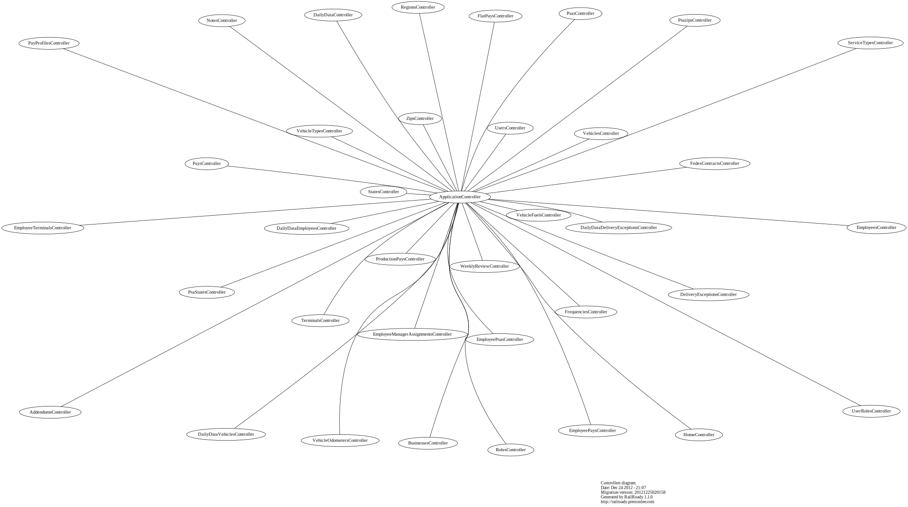

# Linking to SVG files hosted on github

## Linking to RAW files
### Code
    
    

###Result

## Linking to files using [relative paths](https://help.github.com/articles/relative-links-in-readmes)
### Code

    
    

###Result

## Linking to files hosted on github.io
### Code

    
    

###Result

